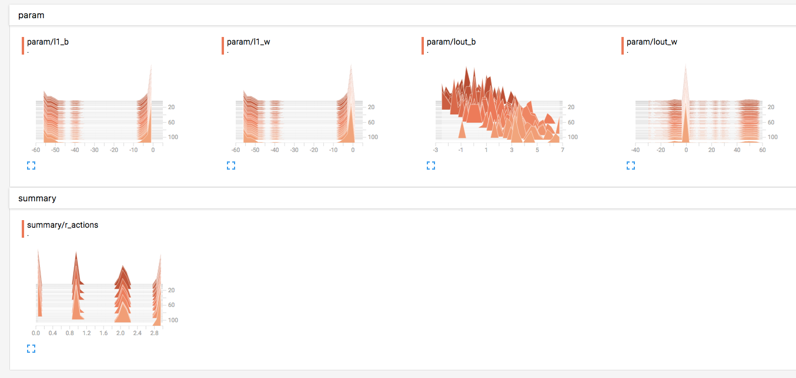

# Forex-DQN

This project is build to trade forex automatically. It is build upon the concept of DQN (Deep Q Network) and projects below.

- [MorvanZhou/Tutorials](https://github.com/MorvanZhou/tutorials)
- [devsisters/DQN-tensorflow](https://github.com/devsisters/DQN-tensorflow)

## Features
- Support tensorboard




## Installation

```
pip3 install -r requirements.txt
```

## Config (Required)

You must create your own config ```train/config.py```. To check the format of the config, you can take a look at ```train/config-tmpl.py```

## Script

#### Train

```
python3 train/index.py
```

#### Help

```
python3 train/index.py -h
```

## LICENSE

#### GPL-3.0